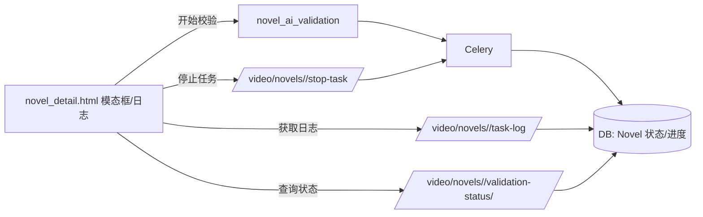
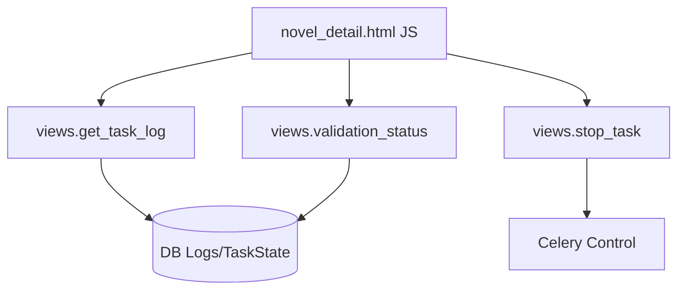

# 设计文档：AI校验前端修复

## 整体架构图

## 分层设计与核心组件
- 表现层：模态框与日志查看器（按钮：开始、清空、暂停/恢复、停止）。
- 逻辑层：`stopValidationTask()`、`fetchValidationTaskLog()`、状态更新函数 `updateValidationTaskStatus()`。
- 服务层：Django 视图路由与 Celery 后台任务。

## 模块依赖关系图

## 接口契约定义
- 停止任务：`POST /video/novels/<pk>/stop-task/`
  - 请求头：`X-CSRFToken`
  - 请求体：`{ task_id: string }`
  - 返回：`{ success: boolean, message: string, task_id: string }`
- 获取日志：`GET /video/novels/<pk>/task-log/?task_id=...`
  - 返回：`{ success, task_id, status, progress, logs: [{ level, message, timestamp }] }`

## 数据流向
- 前端开始任务 → 后端启动 Celery → 状态持久化至 DB。
- 前端轮询日志/状态 → 渲染进度与徽章 → 用户可点击停止任务。

## 异常处理策略
- 网络错误：提示错误并保留重试入口。
- 任务不存在：返回 `success=false` 与 message，前端提示。
- 停止失败：按钮不禁用，显示错误信息。