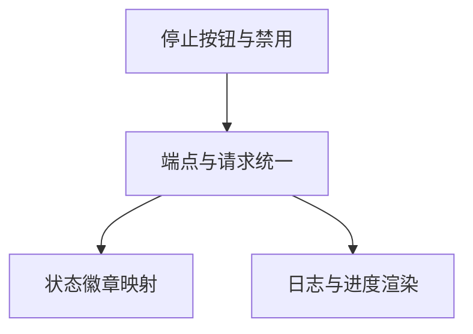

# 原子任务拆分：AI校验前端修复

## 任务1：修复停止按钮并禁用逻辑
- 输入契约：`novel_detail.html` 存在日志查看器区块，按钮触发 `stopValidationTask()`。
- 输出契约：按钮具备 `id="validationStopBtn"`，停止后被禁用。
- 约束：保持页面现有风格与 JS 结构。
- 依赖：任务2 的端点一致性。

## 任务2：统一端点与请求格式
- 输入契约：后端路由 `stop_task` 与 `get_task_log` 定义。
- 输出契约：前端停止与日志请求使用 `/video/novels/<pk>/...`。
- 约束：POST 停止传 JSON，GET 日志带 `task_id` 参数。
- 依赖：任务3 状态渲染。

## 任务3：状态徽章映射统一为 `bg-*`
- 输入契约：后端状态 `PENDING/STARTED/PROGRESS/SUCCESS/FAILURE`。
- 输出契约：中文状态文本与 `bg-*` 类一致。
- 约束：保留/更新 `updateValidationTaskStatus()`。
- 依赖：任务2 的状态返回格式。

## 任务4：日志渲染与进度更新
- 输入契约：`logs: [{ level, message, timestamp }]`；`progress` 数值。
- 输出契约：渲染日志列表、更新进度条、结束态禁用停止按钮。
- 约束：遵循前端现有结构与样式。
- 依赖：任务2 的数据返回格式。

## 任务依赖图
